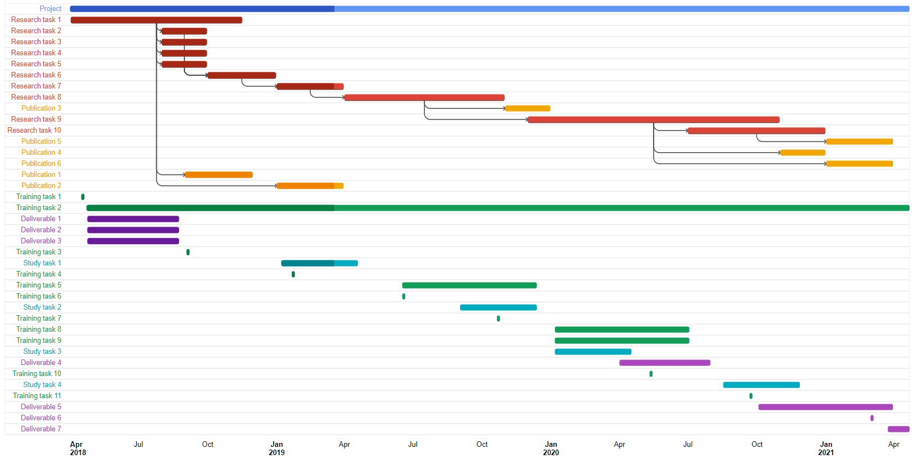

# GoogleCharts

## Gantt Chart

An [example Gantt chart](https://github.com/nmstreethran/GoogleCharts/blob/master/ganttchart.pdf) made using [Google Charts](https://developers.google.com/chart/interactive/docs/gallery/ganttchart) and [Google Sheets](https://docs.google.com/spreadsheets/d/1EyXVLmkQ2jIvdkSvimjWw0RpbofLuMhL7ynmxofqtco/).

## Sources

https://developers.google.com/chart/interactive/docs/spreadsheets

https://stackoverflow.com/questions/42332424/how-can-i-use-google-charts-to-draw-a-gantt-chart-using-data-from-a-google-sheet

## License

Code samples are licensed under the [Apache 2.0 License](https://github.com/nmstreethran/GoogleCharts/blob/master/LICENSE).